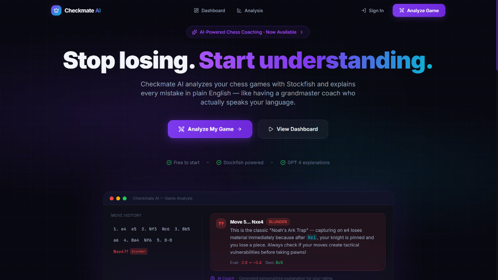
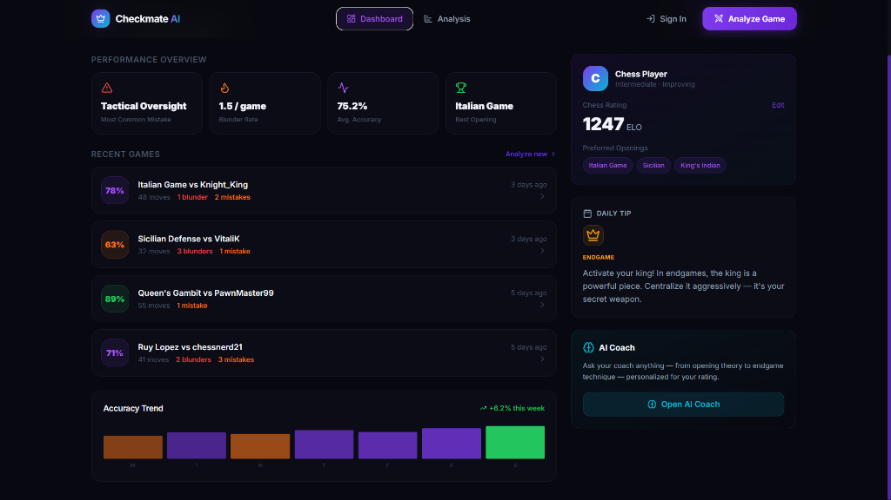
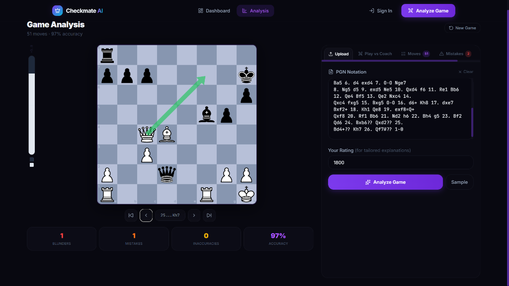
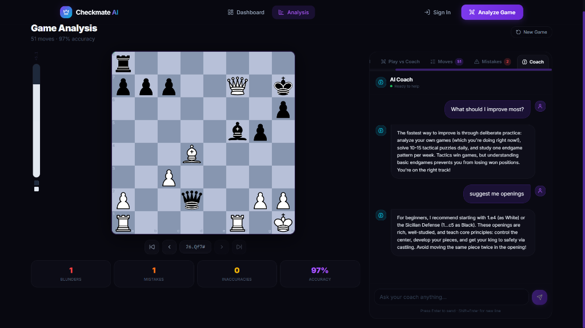

# 👑 Checkmate AI

Checkmate AI is an advanced, AI-powered chess game analyzer and interactive coaching platform. Powered by Stockfish engine evaluations and LLM (Large Language Model) explanations, it helps chess players of all levels review games, understand *why* their moves are mistakes/blunders, and gain tailored insights to improve their gameplay.

This project was built as a learning project to explore AI-assisted product development and the process of turning an idea into a working application, utilizing advanced AI coding tools like Antigravity.

---

## 🚀 Key Features

* **🔍 Deep Game Analysis**: Upload or input your PGN notation to analyze moves, accuracy rates, and pinpoint blunders/mistakes.
* **🤖 AI Chess Coach**: Interactive chatbot coach that provides personalized feedback, recommends opening styles, and explains tactical concepts tailored to your current rating.
* **📊 Player Dashboard**: Track your performance overview (tactical oversight, blunder rate, ELO progress, and accuracy trend) along with recent games history and daily chess tips.
* **♟️ Interactive Analysis Board**: Standard board controls with move navigation, error labels, evaluation bar, and engine recommendations.

---

## 📸 Screenshots

### 🖥️ Homepage
<p align="center">
  
</p>

### 📊 Dashboard
<p align="center">
  
</p>

### 🔍 Game Analysis
<p align="center">
  
</p>

### 💬 AI Coach Chatbot
<p align="center">
  
</p>

---

## 🛠️ Tech Stack

* **Frontend Framework**: [Next.js](https://nextjs.org/) (App Router)
* **Language**: [TypeScript](https://www.typescriptlang.org/)
* **Styling**: [Tailwind CSS](https://tailwindcss.com/)
* **State Management**: [Zustand](https://github.com/pmndrs/zustand)
* **Chess Logic**: [chess.js](https://github.com/jhlywa/chess.js) & [react-chessboard](https://github.com/Clariity/react-chessboard)
* **AI & API Integration**: Stockfish engine, Groq API (for chatbot explanations), Supabase (database & auth)

---

## 💡 Key Learnings & Project Status

* **Status**: Learning Project.
* **AI-Assisted Software Development**: Leveraged AI agents for high-fidelity frontend layout, core game logic loop, state management, and real-time interactive chatbot coach.
* **Product Ideation & Planning**: Worked on design aesthetics, user flows, and features iteration based on real-time feedback.
* **Note**: Some functionality may become unavailable if external API services expire or are discontinued.

---

## ⚙️ Getting Started

### Prerequisites

* Node.js (v18+ recommended)
* npm, yarn, pnpm, or bun

### Installation

1. **Clone the repository:**
   ```bash
   git clone https://github.com/Tarun-410/Checkmate-AI.git
   cd Checkmate-AI
   ```

2. **Install dependencies:**
   ```bash
   npm install
   ```

3. **Set up Environment Variables:**
   Create a `.env.local` file in the root directory and configure the necessary API keys:
   ```env
   NEXT_PUBLIC_SUPABASE_URL=your-supabase-url
   NEXT_PUBLIC_SUPABASE_ANON_KEY=your-supabase-anon-key
   GROQ_API_KEY=your-groq-api-key
   ```

4. **Run the Development Server:**
   ```bash
   npm run dev
   ```

5. Open [http://localhost:3000](http://localhost:3000) with your browser to see the result.

---

## 👤 Author

**Tarun Patil**
* **GitHub**: [Tarun-410](https://github.com/Tarun-410)
* **Email**: tarunckpatil2007@outlook.com
